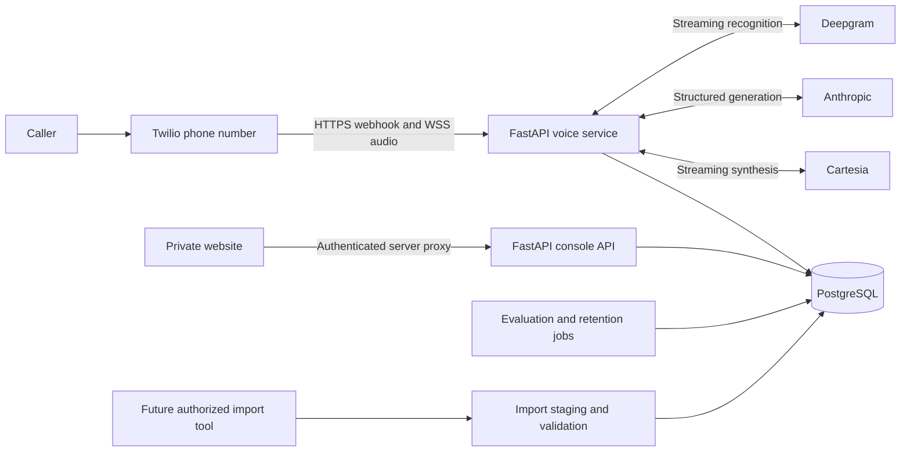

# ArcAgent: data, APIs, cloud deployment, and validation

Research and code inspection: September 9, 2026. Repository baseline: `15e141166edb16cfa6daa0d9e8d5382528496c51`.

This is a practical development and hiring-portfolio plan, not a statement that the product is ready for patients. Vendor prices below are published USD rates checked on the research date. Budget examples are calculations with stated assumptions, not measured ArcAgent costs. Proposed performance targets are acceptance criteria, not results.

Quick navigation: [data sources](#where-to-get-useful-records), [storage and imports](#where-to-store-it-and-how-it-reaches-the-website), [cloud timing](#when-to-deploy-and-what-to-deploy), [API setup](#api-access-and-the-first-local-run), [costs](#published-prices-and-realistic-budgeting), [latency](#fix-the-measurement-system-before-optimizing-latency), [validation](#validation-that-would-stand-up-in-a-startup-interview), [implementation priorities](#concrete-blockers-and-the-next-implementation-sequence), [hiring evidence](#how-to-turn-this-into-hiring-evidence).

## The decision to make now

**Build and test locally with synthetic data, then deploy a small, secure staging system early and iterate through it.** Do not wait until every feature is complete to discover network, WebSocket, and deployment problems. Do not upload patient records to cloud storage as your first step.

You can develop the application and database on your Mac. Calling Twilio, Deepgram, Cartesia, and Anthropic still uses cloud APIs even when your own application runs locally. To receive a real phone call, Twilio needs a reachable HTTPS webhook and secure WebSocket endpoint. A development tunnel can provide these temporarily. An always-on cloud backend becomes useful when you need a stable demonstration number, unattended calls, repeatable network measurements, or collaboration.

Start with the stack already in the repository. You do not need to train a foundation model, rent a GPU, add Kubernetes, or build an EHR integration to demonstrate strong voice-agent engineering.

## What exists today, and where the data is

| Item | Current reality | Where to inspect it |
|---|---|---|
| Website | Privately deployed, with landing page, demo, call review, and evaluation UI | [Hosted website](https://arcagent.pramod-vishwakarma.chatgpt.site), [website setup](web/SETUP.md) |
| Demo records | Fictional calls and illustrative evaluation results compiled into the frontend; not database records | [web/lib/demo.ts](web/lib/demo.ts) |
| Live voice backend | FastAPI code exists. The website deployment did not deploy this Python service | [arcagent/app.py](arcagent/app.py) |
| Live credentials | In the local environment inspected, the Twilio, speech, LLM, public URL, and console credential settings were unset | [configuration](arcagent/config.py), [.env.example](.env.example) |
| Local database | The connection check failed. I could not verify any existing call or evaluation rows; this does not prove that no other database exists | [database connection](arcagent/persistence/db.py), [Docker Compose](docker-compose.yml) |
| Conversation prompts | The current `v1` prompt files still contain `TODO_OWNER`, including the spoken greeting | [prompt status](arcagent/agent/prompts/v1/README.md) |
| Owner benchmark | The persona directory contains a template and README, not a completed business benchmark | [personas](evals/personas/README.md) |
| Automated tests | Previous build validation: 452 Python tests passed, one skipped; 11 frontend tests passed. These are implementation checks, not measured caller success | [tests](tests), [CI](.github/workflows/ci.yml) |
| Live vendor testing | The opt-in integration test currently checks Deepgram connectivity. It is not a complete Twilio, TTS, LLM, routing, and SMS certification | [vendor test](tests/test_vendor_integration.py) |

There is no hidden collection of previous dental enquiry calls bundled with the project. Buying API access also does not buy access to somebody else's historical customer conversations.

The existing README and design documents describe intended behavior as well as implementation. Some statements are stale or stronger than the current code supports. In particular, treat the latency table, disclosure claims, production status, and warm-transfer claims as items to verify, not established performance evidence. This guide leaves those owner documents unchanged.

## Where to get useful records

Different data answers different questions. A call log, a transcript, audio, and a booked-consultation outcome are separate artifacts.

| Source | What you can obtain | How to obtain it | What it validates |
|---|---|---|---|
| Your own staged calls | Audio interactions, saved transcripts, extracted fields, routing decisions | Call a dedicated test number yourself; recruit consenting volunteers using invented identities | Full conversational behavior and real phone-network effects |
| Existing synthetic fixtures | Expected fields, scripted callers, mutations, fake transport events | Use `tests/fixtures/personas/`, `evals/fixtures/`, and the test suite | Deterministic behavior, regressions, and protocol races |
| A practice or agency that agrees to collaborate | Authorized exports of historical enquiries, recordings where available, CRM outcomes | Ask its data owner for an approved, minimized export and permitted use; prefer de-identified cases first | Real language, missing fields, failure frequency, downstream outcomes |
| Your own Twilio account | Call metadata; recordings only if recording was enabled and retained | Twilio Console call logs, Calls API, and Recordings API | Call status, duration, failures, and correlation with your records |
| A partner's CallRail account | Calls, recording references, transcripts subject to account permissions and plan | Account-authorized API credentials or export | Existing acquisition and enquiry workflows |
| A partner's CRM, such as HubSpot | Contacts, call activities, dispositions, appointment/conversion outcomes if recorded | A narrowly scoped authorized app or approved CSV export | Whether qualification led to a real business result |
| Licensed public speech corpora | General speech and sometimes conversational audio/transcripts | Download from the original distributor after checking license and access conditions | Accent, noise, transcription, and segmentation stress tests |

CallRail documents that transcript fields can be null when an account lacks API transcript access. HubSpot call activities can include a recording URL; that URL is not a guarantee that audio is available to you. Both require access to the owning account. [CallRail API](https://apidocs.callrail.com/), [HubSpot Calls API](https://developers.hubspot.com/docs/api-reference/latest/crm/activities/calls/guide).

### Your first dataset

Create a small, deliberately varied set of invented calls before seeking real patient data. Suggested initial coverage: hot buyer, low-intent enquiry, missing callback number, self-correction, pricing objection, hesitant speaker, background noise, interruption, wrong number, existing patient, minor, unsupported language, and unavailable coordinator.

For each case, write the expected extracted facts and acceptable next action **before** observing the agent's output. Ask another person to review the labels. Keep some speakers and scenarios out of prompt tuning so that your final evaluation has an unseen test set. Splitting clips from the same speaker across development and test can leak information about that speaker.

An LLM-generated transcript is synthetic, even when it looks realistic. A simulated caller and agent using similar models can share blind spots. Real volunteer calls and independent human review complement that harness.

### Getting previous calls from Twilio

Use credentials for an account you own or have explicit permission to access. Start by exporting call metadata by date. Preserve the provider Call SID as the external identifier. Fetch recording metadata and audio separately when authorized. Missing recordings cannot be reconstructed from a duration/status record. If only audio exists, offline transcription can create a transcript, but it does not recreate the original live STT events, interruption timing, or production latency.

A recording of a completed human call is useful for replaying caller audio and evaluating extraction. It cannot prove how the original caller would react to the agent's different questions. That requires interactive calls or simulations. [Twilio Calls API](https://www.twilio.com/docs/voice/api/call-resource), [Twilio Recordings API](https://www.twilio.com/docs/voice/api/recording).

### Public datasets you can actually start with

- [LibriSpeech from OpenSLR](https://www.openslr.org/12/) provides read English speech and transcripts under CC BY 4.0. Keep attribution. It is useful for basic recognition checks, not proof of dental conversation quality.
- [Common Voice](https://commonvoice.mozilla.org/en/datasets) provides language/accent coverage through Mozilla Data Collective. Check the selected release's license, data card, and platform terms. Some sets use CC0, but current distribution terms restrict rehosting: keep a source manifest in Git rather than uploading the dataset to your repository. [Mozilla distribution FAQ](https://community.mozilladatacollective.com/faq-can-i-get-the-common-voice-or-other-mdc-datasets-from-other-platforms-like-github-or-hugging-face/), [rehosting FAQ](https://community.mozilladatacollective.com/faq-why-cant-i-re-host-or-share-common-voice-datasets-that-i-download-from-mdc/).
- Domain-specific volunteer roleplays remain necessary for qualification, self-correction, overlap, and routing. No official public collection of historical dental enquiry calls was verified in this research.

For older Twilio records, use BulkExport when required rather than assuming the interactive Calls API returns all history. Twilio directs calls older than 13 months to BulkExport; exported files expire after seven days. Download authorized exports promptly into restricted storage and record their provenance. [Twilio BulkExport](https://www.twilio.com/docs/usage/bulkexport).

### Real dental data requires a separate readiness decision

For work on behalf of a healthcare organization, identifiable enquiry transcripts may be protected health information. Review the full processing chain, including speech/LLM vendors, hosting, database, website, logs, monitoring, backups, and support access. A private GitHub repository or private website does not establish HIPAA readiness. Appropriate agreements and safeguards depend on the actual service and use. [HHS cloud guidance](https://www.hhs.gov/hipaa/for-professionals/special-topics/health-information-technology/cloud-computing/index.html).

Removing a name alone is not reliable de-identification. Free text can retain phone numbers, addresses, dates, employers, and unusual identifying circumstances. Use an approved de-identification process; HHS describes Safe Harbor and Expert Determination. Also establish consent for participation, recording, and reuse for evaluation under the applicable rules. Do not infer jurisdiction just from a phone area code. [HHS de-identification guidance](https://www.hhs.gov/hipaa/for-professionals/special-topics/de-identification/index.html).

For the portfolio stage, fictional identities and explicitly consenting volunteers avoid making real patient access a dependency.

## Where to store it, and how it reaches the website



Live calls already have a persistence path: a stream start creates a call; the session saves turns; finalization saves lead fields, score, and routing records. Failures can leave incomplete records, so build reconciliation and alerts rather than assuming every call was fully saved. [Persistence sink](arcagent/telephony/persistence_sink.py), [routing](arcagent/telephony/routing.py).

| Data | Appropriate home | Existing support and limits |
|---|---|---|
| Call ID, external SID, times, duration, outcome | PostgreSQL `calls` | Existing model |
| Transcript turns, role, interruption flag, stage measurements | PostgreSQL `turns` | Existing; audio is not saved by this path |
| Name, callback number, treatment and insurance signals | PostgreSQL `leads` | Existing sensitive columns; use the chosen environment's access and encryption controls |
| Score and rule contributions | PostgreSQL `lead_scores` | Existing; preserve the rule/prompt version and provenance when extending |
| Callback slots and SMS reference/status | PostgreSQL `slots`, `callbacks` | Existing; delivery status and business completion need stronger reconciliation |
| Evaluation configuration and results | PostgreSQL `eval_runs`, `eval_results` | Text runs save snapshots and transcripts; audio coverage is less complete |
| Authorized original exports or recordings | Encrypted local storage initially, optional private object storage later | No raw-audio archive or importer is implemented; define access, retention, checksums, and consent before adding one |
| Synthetic personas, schemas, migrations, test code | Git | Safe fixtures only; never real transcripts, exports, credentials, or database dumps |
| Operational telemetry | Restricted log/metrics system | Store IDs, durations, error classes, and counters; minimize content and identifiers |

The default development database is Postgres in Docker with a named volume, so restarting the application does not erase records. The example username/password is for local development only. SQLite is convenient for tests; use Postgres for booking concurrency, migrations, and realistic staging checks. [Schema](arcagent/persistence/models.py), [local database](docker-compose.yml).

The live website does not connect directly to Postgres. Its server uses `ARCAGENT_API_URL` and `ARCAGENT_API_TOKEN` to call the Python console API. The token must match `CONSOLE_API_TOKEN` on the backend. `ARCAGENT_ALLOWED_USER_IDS` separately authorizes trusted ChatGPT identities. The current identity integration relies on the Sites hosting boundary; moving the frontend elsewhere requires a supported authentication design, not merely trusting incoming identity headers. [Proxy](web/lib/proxy.ts), [setup](web/SETUP.md).

For viewing records now, the existing Streamlit dashboard is an alternative on your own machine. Do not expose it publicly without authentication. The website demo is always synthetic; configuring a database does not replace `/demo`. Use `/workspace` for connected records.

### Inspecting saved records locally

Once your local database is running and migrated, this reads recent metadata without displaying caller names or transcript text:

```bash
docker compose exec postgres psql -U arcagent -d arcagent -c \
  "SELECT id, started_at, duration_s, outcome FROM calls ORDER BY id DESC LIMIT 20;"
```

For the local review UI, run `.venv/bin/streamlit run dashboard/app.py`. For a saved benchmark, export its inputs with `.venv/bin/python -m evals.snapshots RUN_ID --output inputs.json` and compare compatible runs with `.venv/bin/python -m evals.compare_runs OLD_RUN_ID NEW_RUN_ID`. Exported benchmark files may contain transcript/scenario details: keep them in the storage appropriate to their contents. See [evaluation usage](evals/USAGE.md).

### Import historical records without accidentally calling anyone

There is no historical-call importer in the repository. Build it as a separate command with a dry-run mode, not by replaying records into `/voice/stream` or calling `CallRouter.finish_call`, both of which belong to live side-effect paths.

Proposed import sequence:

1. Receive an approved export into restricted staging storage and record source, permission, retention, and file checksum.
2. Validate the schema, redact where required, normalize timestamps to UTC, preserve missing values, and quarantine invalid rows.
3. Use a durable key such as `(source_system, source_account, external_call_id)` to make retries idempotent. Add source/provenance columns with a migration. Do not fake Twilio SIDs for non-Twilio calls in the current Twilio-specific schema.
4. Insert normalized historical calls and turns in a transaction. Imported business outcomes remain separate from an agent's recomputed score.
5. Run offline extraction/evaluation with telephony and SMS adapters disabled. Save model, prompt, dataset version, expected labels, and output in evaluation records.
6. Reconcile input counts, inserted rows, duplicates, rejected rows, and missing transcripts. Review a sample manually.

A proposed portable record includes `schema_version`, source account and call ID, `started_at`, language, transcript turns, consent/provenance reference, optional private audio object reference, expected fields, expected routing, and observed business outcome. These are proposed import fields, not an existing API contract.

### Keep environments separate

Use separate development, staging, and eventual production databases, credentials, phone numbers, and storage. Develop against synthetic local data by default. A dedicated cloud development database is optional if collaboration requires it; protect its network access and budget. Do not point local experiments at a production database or send production patients to a development process.

Migrations change schema; imports and live calls create data. Deploying code, migrating schema, and uploading records are different operations. There is no need to upload records before the application exists. Back up a database before risky migrations, test restoring the backup, and promote code rather than copying a production database into development.

The current purge script deletes old live-call turns. It does **not** delete lead records, evaluation transcripts, source snapshots, exports, logs, vendor copies, or backups. Add lifecycle policies for each store. Run its dry-run mode before scheduling actual deletion. [Retention implementation](scripts/purge_old_data.py).

## When to deploy, and what to deploy

| Stage | Your application and data | External services | Exit condition |
|---|---|---|---|
| Local correctness | Mac, test fixtures, local Postgres | None for ordinary tests | Business prompts and labeled cases exist; deterministic checks pass |
| Local live integration | Mac and local database; controlled temporary tunnel when testing a real phone | Speech/LLM APIs; Twilio for PSTN tests | One consented fictional call works and is saved; security checks precede public exposure |
| Cloud staging | Always-on Python web service, staging Postgres, current private website | Dedicated vendor credentials and test number | Repeatable calls, monitored failures, trustworthy latency data, restore and deployment tests |
| Limited pilot | Hardened service and appropriately governed data stores | Approved vendors and human fallback | Privacy/security review, operating procedures, measured acceptance criteria, rollback readiness |
| Production iteration | Promote tested releases; monitor and retain incident evidence | Sized for demonstrated concurrency | Controlled releases and regular re-evaluation |

You have already deployed the frontend portion. The next deployment is the smallest secure voice slice, after the blocking items below. Keep writing code locally, test it, push it, deploy to staging, measure it, and promote deliberately. Do not edit the only running production server as your normal development workflow.

For the first staging environment, a managed web service such as Render plus managed Postgres is a practical choice. Render supports inbound WebSockets, but connections close when an instance is replaced. A provider's “zero downtime” HTTP deployment does not preserve an ongoing call's WebSocket or in-memory state. Plan call draining and test interruption during releases. [Render WebSockets](https://render.com/docs/websocket), [deployment behavior](https://render.com/articles/how-render-handles-zero-downtime-deploys).

What to deploy:

- **FastAPI service:** the repository's Python application, agent, speech/telephony adapters, console API, and runtime prompt files. It needs long-lived bidirectional WebSockets and outbound vendor connections.
- **PostgreSQL:** persistent database, migrations, restricted networking, backups, and a restore procedure. Place it near the backend and measure the complete route to the vendors.
- **Website:** the already deployed `web/` application, configured to the staging console API. It does not replace the Python voice server.
- **Jobs:** migrations during controlled releases; callback-slot seeding where appropriate; retention on a schedule; evaluations on demand or scheduled with spending limits.
- **Observability and secrets:** managed runtime secrets, error counters, latency histograms, uptime checks, usage/budget alerts, and deployment identifiers.
- **Object storage later:** only if authorized recording or import artifacts actually need it.

Start with one backend instance and one Uvicorn worker while validating. This is an initial operational simplification, not a capacity guarantee. Coordinator availability is currently process-local; multiple workers could disagree. Before scaling, externalize shared control state, confirm transactional booking behavior, add admission limits, and load-test your exact instance size. [Availability implementation](arcagent/telephony/availability.py).

A proposed Render setup, after implementing the readiness gate:

```text
Service root: directory containing pyproject.toml
Build: python -m pip install -e '.[agent]'
Migration/release command: alembic upgrade head
Start: uvicorn arcagent.app:app --host 0.0.0.0 --port "$PORT" --workers 1
Initial liveness path: /health
```

This is a setup prescription, not configuration already committed or a service already provisioned. `/health` currently reports liveness only; add readiness checks for required configuration and database access. Do not call paid vendor APIs on every health probe. If an uploaded Python wheel is used instead of a repository checkout, verify prompt files and the `evals` module are packaged: the console imports evaluation code, and the current wheel package list includes only `arcagent`. [Render FastAPI guide](https://render.com/docs/deploy-fastapi), [packaging](pyproject.toml).

Keep production releases separate from unrestricted push-to-deploy. Use green checks, an identified image/commit, backward-compatible migrations, and a previous version to roll back to. Use controlled maintenance or a draining strategy for active calls. Add containers/infrastructure-as-code once this first service shape is proven; a Dockerfile is not currently provided for the Python app.

## API access and the first local run

Create accounts directly with the vendors and set project-scoped budgets. API credentials belong in ignored local environment files or a hosting secret manager. A ChatGPT subscription is not an Anthropic, Twilio, Deepgram, or Cartesia API balance.

| Service | Account action | Project setting | First verification |
|---|---|---|---|
| Twilio | Create an account/project, obtain Account SID and Auth Token, provision a suitable voice number, satisfy trial/verification requirements | `TWILIO_ACCOUNT_SID`, `TWILIO_AUTH_TOKEN`, `TWILIO_NUMBER`, controlled `COORDINATOR_NUMBER` | Signed webhook and a call to your own test number; never a customer list |
| Deepgram | Create a project and a scoped API key | `DEEPGRAM_API_KEY` | Streaming mu-law phone audio accepted and recognizable speech transcribed |
| Cartesia | Create an account/API key and choose an available voice | `CARTESIA_API_KEY`, `CARTESIA_VOICE_ID` | Synthesize a short fictional greeting in the configured format |
| Anthropic | Create a Console account/API key and enable billing | `LLM_API_KEY`, `LLM_MODEL` | One schema-conforming completion using an available model |
| Postgres | Start local Docker or create an isolated managed database | `DATABASE_URL` | Migrations and a write/read transaction succeed |
| Tunnel/backend host | Obtain a reachable HTTPS origin | `PUBLIC_URL` | Twilio reaches `/voice/inbound`; derived `/voice/stream` URL uses WSS |
| Console connection | Generate an independent long random server secret and authorize identities | Backend `CONSOLE_API_TOKEN`; website `ARCAGENT_API_URL`, `ARCAGENT_API_TOKEN`, `ARCAGENT_ALLOWED_USER_IDS` | Unauthorized requests fail; an authorized synthetic call is visible |

Official onboarding: [Twilio Voice quickstarts](https://www.twilio.com/docs/voice/quickstart), [Deepgram API keys](https://developers.deepgram.com/docs/create-additional-api-keys), [Cartesia API conventions](https://docs.cartesia.ai/use-the-api/api-conventions), and [Anthropic authentication](https://platform.claude.com/docs/en/manage-claude/authentication). This project's Anthropic adapter explicitly reads `LLM_API_KEY`; setting only the provider's conventional `ANTHROPIC_API_KEY` name does not configure it.

The existing stack uses `nova-2-phonecall`, `sonic-2`, and `claude-haiku-4-5`. Verify their availability and behavior in your accounts; changing a model is a benchmarked experiment. `LLM_MODEL_EXTRACTION` is declared but not used by a separate post-call extraction pass in the inspected implementation. Setting it does not enable that feature. It does, however, select the default simulated caller model in `evals/run_text.py`, so it affects evaluation costs. [STT adapter](arcagent/speech/deepgram_stt.py), [TTS adapter](arcagent/speech/cartesia_tts.py), [LLM adapter](arcagent/agent/llm.py).

Local commands for a new setup, from the repository directory containing `pyproject.toml`; skip environment creation if the environment already exists:

```bash
# Copy only if .env does not already exist; preserve existing credentials.
cp -n .env.example .env
uv venv
uv pip install -e '.[dev,agent,dashboard]'
docker compose up -d
.venv/bin/alembic upgrade head
.venv/bin/python -m scripts.seed_slots
.venv/bin/pytest -q
.venv/bin/python -m scripts.repl
```

The REPL uses the configured LLM and needs completed prompts. Run it only after configuring those. For offline testing, stop at `pytest`. After fixing the public-endpoint and routing issues below, run the backend in one terminal and a tunnel in another:

```bash
.venv/bin/uvicorn arcagent.app:app --reload
ngrok http 8000
```

Set `PUBLIC_URL` to the actual tunnel origin, restart the backend to reload settings, and configure the Twilio number's incoming Voice webhook to `https://YOUR_ORIGIN/voice/inbound` using POST. Keep signature validation enabled. Ngrok offers a limited free development option; check its current quotas before depending on it. A sleeping laptop or closed tunnel ends availability. [ngrok pricing](https://ngrok.com/pricing), [Twilio Media Streams](https://www.twilio.com/docs/voice/media-streams).

The audio harness uses a fake Twilio client against a real server and real speech/LLM APIs. It must share access to the server's evaluation database, and it can reach real routing side effects unless isolated. Add an explicit test-only authenticated transport and injected no-op telephony adapters before using it as a routine cloud job. Fixing WebSocket authentication should not lead to disabling production security to keep the harness working.

## Published prices and realistic budgeting

Rates below match the inspected pipeline. They are not a bundled vendor quote. Country, destination, model, contract, taxes, promotions, rounding, and optional features can change the bill.

| Component | Published unit/rate | How to budget it |
|---|---|---|
| Twilio US local inbound | $0.0085/minute | Entire billed inbound leg |
| Twilio Media Streams | $0.0044/minute | Add streamed duration to voice charges |
| Twilio US local number | $1.15/month | Fixed number rental |
| Twilio US outbound local leg | $0.014/minute | Add coordinator transfer legs where applicable |
| Optional Twilio recording | $0.0025/recorded minute; storage $0.0005/stored minute/month | Not currently enabled by ArcAgent |

Voice rates: [Twilio US pricing](https://www.twilio.com/en-us/voice/pricing/us).

| Component | Published unit/rate | How to budget it |
|---|---|---|
| Twilio US long-code SMS | $0.0083 per inbound/outbound segment, plus carrier and registration charges | Long or Unicode messages can span multiple segments. [SMS pricing](https://www.twilio.com/en-us/sms/pricing/us) |
| Deepgram Nova-2 streaming | $0.35/hour, approximately $0.00583/minute | Published family rate; verify the account's `nova-2-phonecall` metering. [Deepgram pricing](https://deepgram.com/pricing) |
| Cartesia Pro | $5/month with 100K credits | Standard TTS uses approximately one credit per input character. [Plans](https://www.cartesia.ai/pricing), [metering](https://docs.cartesia.ai/pricing) |
| Cartesia Startup | $49/month with 1.25M credits | Subscription floor matters when usage exceeds a smaller allowance. Exact overage rates were not verified. [Plans](https://www.cartesia.ai/pricing) |
| Claude Haiku 4.5 | $1/million input tokens; $5/million output tokens | Count repeated context, instructions, and output, not just the newest utterance. [Anthropic pricing](https://platform.claude.com/docs/en/about-claude/pricing) |
| Claude Opus 5 | $5/million input tokens; $25/million output tokens | Relevant to the default **text-evaluation simulated caller**, not an implemented live post-call extractor. [Pricing](https://platform.claude.com/docs/en/about-claude/pricing), [caller selection](evals/run_text.py) |
| Render staging compute | $7/month web service plus $6/month Postgres | $13 compute-only starting point. Storage, bandwidth, upgrades, jobs, and other services can add cost. [Render pricing](https://render.com/pricing) |
| Railway alternative | Hobby minimum $5/month includes $5 of resource usage; additional usage is billed | Not a guaranteed $5 backend-plus-database total. [Railway pricing](https://docs.railway.com/pricing) |

The smallest paid Render services are a starting configuration to measure, not a proven capacity or healthcare deployment recommendation. Free Render web services sleep after inactivity and free Postgres expires, making them poor foundations for unattended low-latency calling. [Free-service limits](https://render.com/docs/free).

Deepgram advertises a one-time $200 signup credit, not a recurring monthly allowance. Cartesia's free plan lists 20K monthly credits; commercial-use licensing begins with Pro. Twilio's current detailed trial guide describes limited time/units and verified-recipient restrictions, while older pricing text still advertises a different credit grant. Check your actual Console grant rather than counting on a particular free balance. [Deepgram pricing](https://deepgram.com/pricing), [Cartesia plans](https://www.cartesia.ai/pricing), [Twilio trial](https://www.twilio.com/docs/usage/tutorials/how-to-use-your-free-trial-account).

SMS compliance setup is separate from voice setup. US A2P messaging can add brand/campaign registration, campaign vetting, and recurring fees. Complete the registration appropriate to the number and business before real messaging. Opt-out text alone is not the whole process. [Twilio A2P registration](https://www.twilio.com/docs/messaging/compliance/a2p-10dlc).

### Two planning examples

These are **illustrative monthly consumption scenarios**, not measured usage, total production quotes, or promised operating costs. Both assume US local inbound calls, all call minutes sent through Media Streams and Nova-2, no transfer legs, no recordings, and the following per-call usage: 800 TTS input characters, 10,000 Haiku input tokens across all turns, and 500 Haiku output tokens. Each uses half as many one-segment outgoing SMS messages as calls. Fractional cents are rounded only in displayed totals.

| Cost item | 100 calls × 3 minutes | 1,000 calls × 3 minutes |
|---|---:|---:|
| Inbound voice plus Media Streams | $3.87 | $38.70 |
| Nova-2 | $1.75 | $17.50 |
| Haiku | $1.25 | $12.50 |
| Cartesia subscription fitting assumed characters | $5.00 Pro for 80K characters | $49.00 Startup for 800K characters |
| Base SMS segment charges | $0.415 | $4.15 |
| One phone number | $1.15 | $1.15 |
| Minimal staging compute | $13.00 | $13.00 |
| **Illustrative subtotal** | **$26.44** | **$136.00** |

Arithmetic uses the cited rates above. Excluded: carrier/campaign fees, taxes, billable rounding, transfers, recordings, storage/egress, monitoring, jobs, failures/retries, trial credits, and all evaluation traffic. The existing frontend's account-specific hosting cost was not verified and is also excluded. The larger example does not imply the smallest compute plan can handle the associated concurrency. TTS allowance is approximate because preprocessing can affect credit usage.

Use this formula to replace assumptions with observed usage:

```text
monthly cost = compute + database/storage + website + number rental
             + inbound billed minutes × inbound rate
             + streamed minutes × stream rate
             + STT metered hours × model rate
             + sum(input and output tokens × their model rates)
             + TTS subscription and any overage
             + transfer-leg minutes and optional conference charges
             + SMS segments, carrier fees, and campaign fees
             + recordings, observability, jobs, egress, tax, and other account charges
```

Evaluation can cost more than a small demo's real traffic. A text run pays for both the agent and simulated caller over every scenario/repeat. The current `run_text` default uses `LLM_MODEL_EXTRACTION` for the caller, which defaults to Opus 5; choose `--caller-model` deliberately and record the change in the snapshot. Audio evaluation also synthesizes the caller's voice in addition to the agent's, and submits that audio to STT. No Twilio phone-minute charge is inherent in the fake transport itself, but an accidentally enabled routing side effect can still contact Twilio. [Text runner](evals/run_text.py), [audio runner](evals/run_audio.py).

For initial exploration, set a personal spending ceiling, separate experiments by project/run ID, restrict concurrency, cap call duration and model output, and review vendor usage after the first few runs. A budget alert may not be a hard spending stop. Keep provider retries bounded and do not blindly retry a transfer or SMS after an ambiguous timeout. Measure cost per attempted call and cost per **confirmed useful next step**, not just nominal speech minutes.

## Fix the measurement system before optimizing latency

The current latency columns are useful starting points but do not yet justify an end-to-end performance claim. These are observations from code inspection, not newly reproduced production incidents:

| Observation | Why it matters | First change and verification |
|---|---|---|
| `stt_final_ms` starts at the last received audio frame | Phone streams can continue sending silence; the latest frame is not necessarily the end of human speech | Track a defined speech-end boundary, with its clock origin and confidence, separately from media receipt |
| `response_ms` begins at STT finalization | Its implementation excludes endpoint-detection delay despite its speech-end wording, and it is not stored in the four-column output | Store an explicit speech-end-to-first-outbound-frame metric and keep post-final response latency separate |
| LLM adapter measures token arrival, but the responder waits for a complete structured response | Session `llm_ttft_ms` is marked when text is yielded after graph work, not necessarily at the first provider token | Carry provider TTFT, structured-completion time, graph duration, and first speakable-text time independently |
| The current turn timing object is replaced when a caller final arrives; writer and mark events update `_pending_timings` | Audio acknowledgements can be attributed to the next turn's object instead of the utterance being played | Associate timing state with immutable turn/context/mark IDs and verify delayed-event correlation |
| Agent records are saved before playback acknowledgement | The saved row can contain missing timing fields even when later events occur | Update a record when its lifecycle closes, with explicit interrupted/cleared/completed status |
| `playback_start_ms` uses a Twilio mark acknowledgement | A mark follows completed playback, or can return after clear; it does not measure first audio heard by the caller | Rename/interpret as playback acknowledgement and distinguish cleared marks; use an external probe for audible onset |
| Tier-two summary uses `playback_start_ms` as its latency sample | A completion acknowledgement cannot establish speech-end-to-first-audio performance | Repair metric definitions and collect external wall-clock/audio evidence before publishing percentiles |

Sources: [timing code](arcagent/telephony/latency.py), [session event handling](arcagent/telephony/call_session.py), [structured LLM](arcagent/agent/llm.py), [graph responder](arcagent/agent/responder.py), [audio harness](evals/run_audio.py). Twilio describes both normal mark completion and mark returns after clearing buffered audio. [Twilio mark/clear semantics](https://www.twilio.com/docs/voice/media-streams/websocket-messages).

Use monotonic clocks for elapsed time within a process, UTC timestamps for cross-system logs, and correlation IDs throughout. Do not subtract unrelated machine monotonic clocks or sum overlapping stage durations as an end-to-end measurement. Separate time to first audio written, transport delivery, actual caller-heard audio, and time to finish the reply.

Record at least: call/turn/context ID, build and prompt version, endpoint decision, provider TTFT, full structured completion, first TTS byte, first outbound frame, playback completion/clear, cancellation completion, dropped frames, queue depth, and failure category. Keep raw patient utterances out of ordinary telemetry.

Then run controlled experiments in this order:

1. Establish a baseline on fixed recorded/synthetic caller audio and a real phone subset. Report sample count, missing measurements, failures, p50, p95, and p99 only when the sample supports it.
2. Fix transcript assembly and interruption correctness before lowering silence thresholds.
3. Sweep the existing endpointing and utterance-end settings against hesitant speakers, short answers, and background noise. Change one factor at a time.
4. Compare shorter prompts, constrained outputs, context trimming, and a faster model using the same qualification benchmark. A first token arriving faster is not enough if structured completion still delays speech.
5. Consider decoupling safe speakable text from slower extraction, with deterministic routing still based on validated fields. Treat speculative speech as a cancellation/accuracy tradeoff, not an automatic win.
6. Measure persistent connection reuse, database waits, region placement, outbound queue limits, and event-loop lag. The persistence sink uses a worker thread but callers still await it at some boundaries; measure that delay.
7. Add a small concurrent-call sweep, for example 1, 2, 5, and 10 calls, stopping when quality or latency degrades. These are proposed test levels, not claimed capacity.

The existing design mentions an under-800 ms response goal. Treat it as an aspirational budget until the measurement definition is repaired and actual calls substantiate it. Optimize the quality/cost/latency tradeoff together, including false interruptions and lost lead fields.

## Turn detection and audio correctness

Deepgram's `is_final` indicates a stable transcript segment; `speech_final` indicates endpoint detection. They are not interchangeable. Final segments can arrive before the utterance ends and should be accumulated appropriately. The current session only enqueues the text on an event with both flags, while `UtteranceEnd` only refreshes activity. That creates a code-level risk of losing earlier finalized segments or failing to flush a pending utterance. Add a small deterministic event-sequence test before changing this behavior. [Deepgram final/endpoint semantics](https://developers.deepgram.com/docs/understand-endpointing-interim-results), [UtteranceEnd](https://developers.deepgram.com/docs/utterance-end), [session](arcagent/telephony/call_session.py).

Test these separately:

- A long answer split into several final segments, followed by a final endpoint.
- A pause inside a phone number or date, followed by a correction.
- An `UtteranceEnd` event without the expected final endpoint event.
- Duplicate, delayed, and revised events without duplicated caller turns.
- “Mm-hmm” or a short affirmative while the agent speaks versus “stop” or an urgent correction. The current word-count rule alone cannot express every intention.
- Speech onset while the LLM is generating, while TTS is producing audio, while frames are queued, and while Twilio is playing buffered audio.
- Late chunks and marks from a cancelled context; nothing from that context should leak into the next reply.
- Silence, television speech, background speakers, accents, speech impairment, packet gaps, disconnects, and prolonged calls.

Keep mu-law at 8 kHz throughout the telephony application as the repository requires. Public audio with another format can be converted by an **offline dataset preparation tool**, with the transformation recorded; do not quietly add resampling to the live path. An inbound-only media track does not eliminate acoustic echo from a caller using speakerphone, so include that case in real-device testing.

The current `_spoken_so_far` value is not a word-aligned proof of what the caller heard before interruption. Track generated, queued, and acknowledged audio separately and report the uncertainty. Likewise, test language detection against the actual STT configuration: the presence of a Spanish fallback branch does not establish reliable Spanish detection or durable callback capture.

## Validation that would stand up in a startup interview

| Layer | What to test | Evidence to save |
|---|---|---|
| Business rules | Score boundaries, missing facts, conflicting facts, coordinator unavailable | Pure-function cases and exact expected decisions |
| Extraction | Entity accuracy for names, numbers, dates, treatment, insurance signals; hallucinated values | Reviewed labels, per-field confusion/error summaries, examples |
| Conversation | Repetition, inappropriate claims, refusal/opt-out, corrections, handoff/callback completion | Held-out scenarios, transcripts, human review rubric |
| Speech | WER/CER plus entity-specific accuracy; noise, accent, codec, pace | Licensed/consented dataset manifest and per-condition results |
| Turn taking | Missed and false barge-ins, premature endpoints, talk-over, recovery delay | Timestamped event traces and reproducible audio cases |
| Routing | Coordinator busy/no-answer, invalid number, disconnect during transfer, no callback slot | Provider event reconciliation; requested action versus confirmed outcome |
| Reliability | STT/TTS/LLM disconnect, timeout, rate limit, malformed output, database outage | Fault injection, bounded timeout/retry evidence, fallback behavior |
| Concurrency | Simultaneous slot booking, queue growth, cancellations, worker restart | Load report, invariants, leaked-task checks, database consistency |
| Security | Forged webhook/WebSocket, unauthorized console/admin, abuse limits, secret leakage | Negative tests and a concise threat model |
| Privacy | Transcript/DTMF/log redaction, retention, deletion, access audit | Test records and deletion/restore verification |
| Operations | Readiness failure, migration failure, deploy during call, rollback, backup recovery | Runbook and incident timeline |
| Economics | Per-call provider usage, failed calls, retries, evaluation spend, concurrency | Reconciled usage ledger and cost per successful next step |

Use several forms of evidence, rather than a single aggregate pass rate:

- Deterministic offline tests run on every change.
- Text evaluation runs save prompt/configuration/dataset snapshots and compare compatible runs using the existing guards.
- Audio replay exercises the real speech adapters, with isolated telephony effects and corrected timings.
- Real phone calls test PSTN transport, actual playback, interruptions, transfer behavior, and device effects.
- Human review measures whether a conversation feels usable and whether the next step actually occurred.

The present audio harness waits for an agent mark before sending the next caller utterance, so it does not by itself create a robust overlap/interrupt test. It also reads the agent text from the database and marks a result as passed when no execution error was recorded. Extend it to verify business expectations and independently assess generated audio. Audio runs currently lack the complete snapshot/evidence needed for the text comparison's merge verdict. [Audio harness](evals/run_audio.py), [fake transport](evals/fake_twilio.py), [comparison contract](evals/USAGE.md).

Keep test fixtures, development scenarios, and a held-out benchmark distinct. Split by caller/session where possible. Report subgroup sample counts and uncertainty; do not claim broad accent fairness from a few examples. Use model judges as supporting reviewers, calibrated against humans, rather than treating another model's approval as ground truth.

Suggested acceptance gates:

- No unauthorized request can start billable work or read/change workspace state.
- No duplicated SMS, booking, or transfer on a retried operation.
- No stale audio after an acknowledged cancellation in deterministic race tests.
- No guarded handoff-recall regression on a complete compatible benchmark.
- Every failed call has a distinguishable outcome and sufficient safe telemetry to investigate it.
- Latency improvements are reported alongside extraction quality, interruption errors, and cost.

These are proposed release criteria. The project has not yet demonstrated them all.

## Concrete blockers and the next implementation sequence

| Priority | Work item | Completion evidence |
|---|---|---|
| Before public phone testing | Add complete business prompts in a new version; prepare labeled benchmark personas while respecting owner-authored files | Greeting contains real disclosure text; a text conversation completes without placeholder content |
| Before public phone testing | Authenticate `/voice/stream` before accepting and opening vendor connections; secure or disable `/voice/echo` and `/admin/coordinator` | Invalid WebSocket/admin requests fail before spending money; authorized Twilio requests pass |
| Before routine audio evaluation | Add an isolated, explicitly authorized test mode with fake transfer/SMS actions | Running the audio harness cannot contact a real recipient or operate on production records |
| Before claiming latency | Fix per-turn timing association, persisted lifecycle updates, provider TTFT propagation, and metric naming | Synthetic clocks plus delayed-event tests validate known durations and correct turn attribution |
| Before endpoint tuning | Assemble final transcript segments and define exactly-once utterance completion | Multi-segment, delayed, duplicated, and `UtteranceEnd` tests preserve the whole utterance |
| Before a live demo | Prove terminal audio finishes before transfer/hangup; reconcile transfer completion and callback outcomes | Real controlled calls plus provider status evidence; no “booked” success when no slot exists |
| Before unattended staging | Handle startup/partial vendor failures, persistent database failures, quotas, timeouts, and admission limits | Fault-injected calls end safely, close sockets/tasks, and leave an actionable record |
| Early staging | Deploy one service and database, connect the website, add usage and failure monitoring | A fictional live call appears in `/workspace`; restart and backup/restore exercises succeed |
| After baseline | Run the endpoint/model/region/concurrency experiments above | Reproducible before/after reports with costs, sample counts, and regressions |
| Before importing partner data | Build dry-run importer, provenance, idempotency, lifecycle rules, and reviewed access controls | Authorized synthetic export imports twice without duplicate rows or side effects |
| Before real patient pilot | Complete healthcare/privacy readiness and operational review for the actual vendors and environment | Appropriate agreements, consent handling, access audits, deletion, incident and fallback procedures |

Several blockers have direct code evidence. The WebSocket routes currently accept without the HTTP webhook signature dependency. Vendor clients start before the session's protected cleanup region. Routing can report `callback_booked` even when there is no slot, and transfer success is based on the update request rather than a confirmed coordinator connection. `_speak` queues audio and a mark but does not itself await the mark before terminal handling. Investigate these with targeted tests; do not treat an existing unit-test total as proof of the end-to-end action. [App](arcagent/app.py), [session](arcagent/telephony/call_session.py), [routing](arcagent/telephony/routing.py), [Twilio actions](arcagent/telephony/twilio_actions.py).

Also review per-digit DTMF logging, durable storage of fallback callback digits, consent evidence at booking, process-local availability, booking races, and the difference between an SMS accepted by a provider and delivered to a phone. These are concrete review targets, not a claim that every case has been reproduced and diagnosed.

## How to turn this into hiring evidence

Build artifacts around the skills a voice-agent startup needs. The point is to show a decision, a measured consequence, and a reproducible investigation.

| Skill | Demonstration in this project | Portfolio artifact |
|---|---|---|
| Async/backend engineering | Own one-writer audio flow, cancellation, resource cleanup, and backpressure | A regression test that reliably catches a real race |
| Speech systems | Explain endpointing, segment finalization, codec/frame constraints, and audible versus server latency | Annotated timing trace and an interruption demo |
| Applied LLM engineering | Compare prompt/model alternatives without sacrificing deterministic routing | Versioned benchmark with field accuracy and handoff metrics |
| Data engineering | Normalize and deduplicate an authorized historical export; preserve provenance | Import dry-run and reconciliation report using synthetic records |
| Product engineering | Trace an enquiry from first utterance to a confirmed next step | Call review with an honest score explanation and outcome |
| Reliability/SRE | Inject vendor failure, restart during a call, recover data, roll back | Incident report, operational dashboard, and runbook |
| Security/privacy | Threat model public endpoints and isolate credentials/data/environments | Negative tests and explicit readiness gaps |
| Cost/performance judgment | Compare measured cost, response delay, and quality under load | A tradeoff table derived from actual usage |
| Communication | Explain why a bug escaped earlier tests and what changed | Short postmortem with reproduction and prevention |

A strong eventual interview package would contain a short private demo, architecture/data-flow diagram, reproducible setup, one independently reviewed benchmark, a latency/cost report, and several substantive failure write-ups. Prefer a few well-understood failures over a long list of tools. Do not publish patient examples to make the portfolio seem realistic. Hiring requirements vary by role; these artifacts demonstrate engineering judgment more directly than claiming every framework or cloud service.

## The next working sessions

**First session:** finish the prompt/benchmark foundation and add tests for unauthenticated WebSocket access, lost final transcript segments, and incorrect timing association. Keep the data synthetic. Establish a reproducible local database and test command.

**Second session:** implement those fixes and an isolated audio-evaluation path. Configure vendor accounts with low budgets, verify one short request per service, then conduct a small number of controlled phone calls. Record failures instead of immediately tweaking several settings.

**Third session:** deploy staging after the public-exposure gate passes. Connect the private website, verify persistence and authorized access, and test a restart and a failed vendor connection. Establish a corrected latency baseline before optimizing it.

**Following sessions:** run one-variable experiments, add held-out callers, measure concurrency and cost, and write failure reports. Seek a partner's authorized historical sample only when the ingestion and privacy controls are ready. Add a pilot deployment after the evidence supports it.

This sequence lets you learn cloud operations while the product evolves, preserves a fast local development loop, and gives every new infrastructure component a specific reason to exist.
