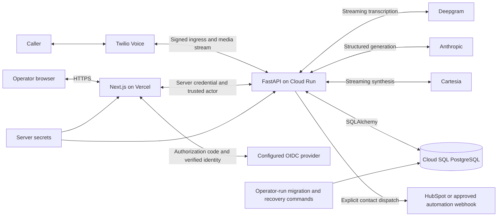

# Architecture

ArcAgent combines an inbound dental enquiry voice agent with an operator workspace. The voice agent gathers information and applies deterministic qualification rules. Staff use the workspace to inspect evidence, assign enquiries to locations, track follow-up, and explicitly export contact details to configured services. These are separate operations with separate evidence of success.

## Deployment and trust boundaries

This diagram describes the implemented paths, including provider connections that are not activated. The browser receives workspace responses, not backend bearer credentials or database credentials. Voice signatures and website identity protect different entry points. Production voice checks do not accept the development signature bypass. Console authorization is enforced again at the backend.

The staging backend and persistent database have been deployed, and synthetic authenticated reads and writes have been observed. The website is hosted separately. Google client registration and operator approval remain activation work; missing authentication configuration blocks the workspace. Voice credentials, approved prompts, and controlled real-call validation remain outstanding. CRM adapter implementation does not establish a successful live export. See [cloud deployment evidence](../CLOUD_STAGING.md), [identity and call activation](../NATIVE_AUTH_AND_LIVE_VALIDATION.md), and [integration activation](../INTEGRATIONS_SETUP.md) for current release evidence and owner steps. A local source change is not deployed until its release and migration are recorded there.

The staging deployment uses disposable application instances and a persistent database. Process-local call tasks cannot resume an interrupted audio session after a restart. Scale settings, budget alerts, and cold starts are operational constraints, not reliability or spending guarantees. Migrations run as an explicit deployment step with a separate identity. See [deployment configuration](../deploy/cloudbuild.yaml) and [staging runbook](../STAGING_RUNBOOK.md).

## Runtime boundaries

| Boundary | Responsibility | Main source |
| --- | --- | --- |
| Voice ingress | Authenticate Twilio requests and stream upgrades; gate readiness before opening speech sessions | [app](../arcagent/app.py), [security](../arcagent/telephony/security.py) |
| Call session | Assemble utterances, coordinate reply cancellation, serialize outbound audio, record turn evidence | [call session](../arcagent/telephony/call_session.py) |
| Conversation | Traverse a bounded graph, validate node-owned structured model output, compute deterministic qualification | [graph](../arcagent/agent/graph.py), [LLM](../arcagent/agent/llm.py), [scoring](../arcagent/agent/scoring.py) |
| End-of-call actions | Persist qualification before transfer or callback action; distinguish request acceptance from observed outcome | [routing](../arcagent/telephony/routing.py), [transfer state](../arcagent/telephony/transfer_state.py) |
| Website access | Verify identity, enforce operator allowlist and same-origin writes, proxy approved API routes | [native auth](../web/lib/native-auth.ts), [proxy](../web/lib/proxy.ts) |
| Staff workflow | Store location assignment, stage, ownership, due dates, contact corrections, and revision-checked audit history | [pipeline](../arcagent/console/pipeline.py), [workflows](../arcagent/console/workflows.py) |
| Contact export | Persist an immutable minimal payload, claim an attempt before network I/O, reconcile uncertain outcomes | [integration service](../arcagent/integrations/service.py), [worker](../arcagent/integrations/worker.py) |
| Evidence and storage | Persist call/turn records, expose bounded reads, redact eligible transcript text without deleting delivery intent | [models](../arcagent/persistence/models.py), [console](../arcagent/console/api.py), [retention command](../scripts/purge_old_data.py) |

The deployment represents a shared dental-group workspace with location filters. Location assignment is not a tenant isolation boundary. All allowed operators belong to the same group access boundary. An independently isolated clinic product would require additional authorization and data partitioning.

## Voice behavior

Native mu-law audio passes from Twilio to Deepgram and from Cartesia back to Twilio without application resampling. Independent session loops handle incoming media, transcription, conversation turns, outbound audio, and silence. Only the writer loop sends outbound audio frames; other work queues frames. This limits competing writers, but does not make playback overlap, disconnects, or vendor failure impossible.

Final transcription segments are joined until an utterance boundary. Interim speech can interrupt a reply according to the configured barge-in rule. Interruption invalidates playback marks, drains queued audio, clears Twilio playback, cancels the current reply, and cancels synthesis. Cleared marks cannot certify completed playback. Late frames are associated with reply contexts so discarded contexts can be rejected. [Turn-taking documentation](turn_taking.md) and [session tests](../tests/test_barge_in.py) describe the cancellation contract.

The graph controls the conversation; structured model output supplies extraction and phrasing within the current node. Scoring uses explicit extracted fields and configuration, not a model judgement of whether a lead is hot. Deterministic scoring makes equal inputs reproducible; changes in configuration, extraction, persistence, or routing can still change observed outcomes.

## Persistent meaning

| Record | What it means | What it does not prove |
| --- | --- | --- |
| Call and turns | An observed session and its stored transcript, interruption, and timing evidence | A qualified lead or successful human conversation |
| Lead and score | Extracted or corrected contact data and a rule-based qualification decision | Clinical suitability or a completed sale |
| Callback and slot | A held callback window with consent and any stored SMS receipt | Staff actually called or the recipient read the message |
| Location and lead pipeline | Staff assignment, owner, next action, and manually maintained business stage | Automatic verification of attendance, treatment, payment, or revenue |
| Transfer attempt and progress | Persisted intent, vendor acceptance, and authenticated callback evidence | Acceptance alone is not an answered transfer; an answered child leg alone does not prove a bridge |
| Integration delivery | Contact export intent, attempt status, and acknowledgement classification | A webhook acknowledgement does not prove its downstream automation completed |
| Follow-up and audit | Human recovery work and who changed a record | Completion of the external action unless independently evidenced |
| Evaluation run and result | Versioned simulation evidence for regression comparison | Real-call latency or production performance |

Schemas are split across [core models](../arcagent/persistence/models.py), [pipeline models](../arcagent/persistence/pipeline_models.py), [transfer models](../arcagent/persistence/transfer_models.py), [integration models](../arcagent/persistence/integration_models.py), and [workflow models](../arcagent/persistence/workflow_models.py).

The call table stores a caller-number hash. Leads contain contact data, transcripts can contain sensitive speech, and integration payload snapshots duplicate the minimal contact fields required for dispatch. No application audio recording is persisted by the live session path. This is not a claim that every provider or evaluation artifact is free of sensitive data.

The retention command defaults to preview. Explicit application redacts eligible completed-call transcript text while retaining turn timing, calls, leads, workflow history, and delivery/idempotency evidence. It does not delete backups, vendor copies, evaluation transcripts, extracted fields, or contact snapshots. It is not scheduled automatically. The [query and response guide](query_response_architecture.md) explains storage inspection and mutation behavior.

## Validation and remaining boundaries

Offline text evaluations exercise the conversation graph; audio evaluations exercise the session path through an isolated evaluation capability that does not execute real transfers or callback messages. Compare runs with compatible configuration and inspect failures rather than treating a passing test suite as deployment evidence. See [evaluation entry points](../evals) and [handoff](../PROJECT_HANDOFF.md) for current commands and observed results.

Controlled calls still need to establish audible behavior, interrupted speech handling, verified bridge/no-answer outcomes, and measured latency under deployment conditions. Backup restoration, retention policy approval, native sign-in activation, provider configuration, and external integration verification are separate acceptance gates. Recovery commands are available, but their presence does not mean they are scheduled or have been exercised against real failures.
