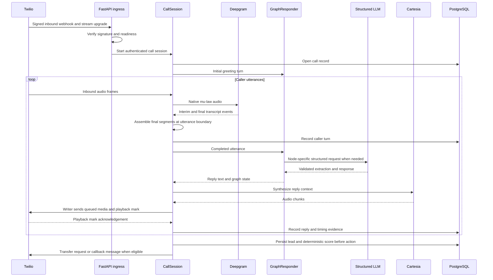
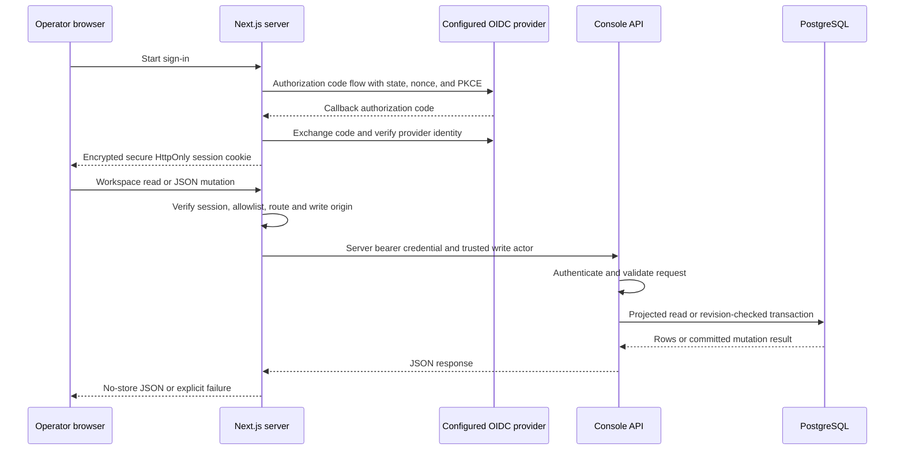
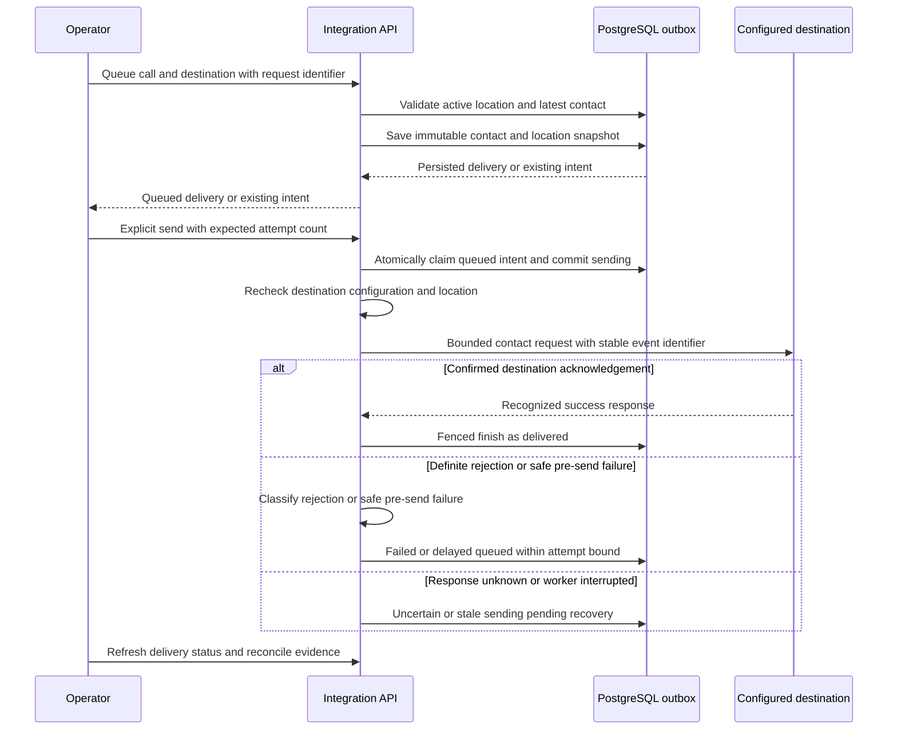

# Query, response, and storage architecture

ArcAgent has distinct query paths: a caller speaks into a streaming conversation, an operator reads or updates workspace records, and an operator explicitly dispatches a saved contact export. They share PostgreSQL evidence, but a successful response has a different meaning on each path. The [architecture overview](architecture.md) identifies deployment and activation status.

## Voice query and response

The graph includes pure transitions and fixed replies, so not every utterance requires a model call. Structured output is streamed to observe model time to first token, then parsed and validated before use. The scoring function consumes extracted fields and explicit configuration. The persistence-before-action boundary is in [CallRouter](../arcagent/telephony/routing.py); the speech and generation boundaries are in [CallSession](../arcagent/telephony/call_session.py), [GraphResponder](../arcagent/agent/responder.py), and [structured LLM](../arcagent/agent/llm.py).

Interruption can happen while the reply branch is running. The session invalidates mark ownership before clearing Twilio playback, drops queued frames, cancels the reply task and synthesis context, and records interruption. A mark returned because audio was cleared is not completion evidence. Silence, disconnect, language fallback, and malformed media have separate branches; the diagram shows the normal path rather than promising every call reaches qualification.

Timing fields measure specific boundaries: `stt_final_ms` runs from the latest inbound audio frame to the final transcription boundary; `llm_ttft_ms` measures model request to first token; `tts_first_byte_ms` measures synthesis request to first audio; `playback_start_ms` currently ends at the returned Twilio mark. Despite that last field's name, a returned mark is a playback acknowledgement, not a direct observation of when the caller first heard sound. Missing stages remain null. See [timing implementation](../arcagent/telephony/latency.py); real caller-perceived latency requires controlled measurement.

Transfer processing has its own durable state. The router writes intent before a vendor update. Signed callbacks correlate call identity and attempt identity, record child-leg progress, and distinguish a confirmed bridge from no-answer or unresolved outcomes. An accepted request remains pending evidence. A stale reconciliation command can mark unresolved attempts for recovery; it must not blindly retry a possibly accepted transfer. See [callback handler](../arcagent/telephony/transfer_webhooks.py), [state transitions](../arcagent/telephony/transfer_state.py), and [reconciliation command](../scripts/reconcile_transfers.py).

## Website query and response

[Native authentication](../web/lib/native-auth.ts) binds transactions and sessions to the configured issuer/client and derives a stable actor from provider subject. [The auth adapter](../web/app/chatgpt-auth.ts) selects the host's supported identity path. Google client setup remains required for the native deployment; an implemented login route is not proof that an account can currently sign in.

The [server proxy](../web/lib/proxy.ts) restricts routes and query parameters, keeps the backend token server-side, validates mutation origin and bounded JSON bodies, and refuses redirects. Backend APIs enforce their own console credential and trust actor attribution only behind that credential. A timeout after a write can mean the transaction committed but its response was lost. The browser must refresh before retrying; optimistic revision checks reject stale edits, and request identifiers deduplicate supported create operations. An unavailable backend must not silently substitute fictional records. Demo data is an explicitly separate mode.

## Read shapes and queue semantics

List endpoints return the fields needed by the list. Call summaries project the latest lead and latest score instead of hydrating transcript or clinical history. Evaluation lists aggregate result scalars for the selected run page without loading full transcripts, expected/actual payloads, notes, or configuration snapshots. Detail endpoints expose the fuller evidence only when requested. See [console reads](../arcagent/console/api.py).

The [pipeline endpoint](../arcagent/console/pipeline.py) accepts location, stage, owner, due-date, and pagination filters. `unassigned=true` means no location; `owner=unassigned` means no assigned staff member. Due queues cover active workflow stages: `overdue` means the next action precedes a captured UTC reference time, `scheduled` means it is at or after that time, and `unscheduled` means no next-action date. Missing workflow state is treated as unassigned and unscheduled. Won and lost records do not enter due-action queues.

Location, due, and owner filters define the summary population. The optional stage filter further restricts rows and their total; pagination does not shrink the summary. This lets a coordinator see workload totals while paging through a subset. These projections and indexes improve query shape; they do not establish a production throughput or latency claim. The workspace loads storage health when that view is opened. Pipeline filter changes refresh pipeline rows rather than reloading unrelated delivery and pilot panels; location and destination reference data load on mount and explicit refresh.

## Contact export query and response

Queueing creates intent, not an external contact. The immutable snapshot contains contact name/phone and clinic location metadata, excluding medical fields and transcripts. Duplicate request identifiers and duplicate call/destination intent are guarded. Contact correction after queueing does not rewrite a queued payload. Dispatch rejects changed destination configuration and inactive or reassigned locations rather than silently exporting under a different route.

HubSpot receives standard contact properties; location metadata stays in the delivery record because no custom HubSpot schema is assumed. Automation receives the snapshot and stable event identifier. These adapters are not a universal CRM upsert: separate calls from the same person can still create duplicate contacts. A receiver must implement its own idempotency contract to deduplicate automation events. See [payload creation](../arcagent/integrations/service.py) and [setup and provider contracts](../INTEGRATIONS_SETUP.md).

The [dispatcher](../arcagent/integrations/worker.py) commits a claim before network I/O and conditions completion on the same active attempt. A recovered stale worker cannot later overwrite the reconciled state. Public-address validation, pinned destination addressing, TLS hostname checks, bounded DNS/HTTP operations, disabled redirects, and server-configured provider domains constrain outbound requests. These controls do not provide distributed exactly-once delivery.

Known safe retry classifications remain queued with a delayed next attempt and an attempt bound. They still need another explicit operator dispatch or an explicitly invoked sending worker. Unknown network responses and expired sending claims become `uncertain`; no automatic replay is permitted. An operator must inspect the destination before taking any further external action. There is no general terminal-delivery requeue endpoint. The worker defaults to dry-run, and no scheduler is implied by its existence. A `delivered` automation record means the webhook acknowledged the request, not that every downstream action succeeded.

## Storage inspection and retention

[PostgreSQL models](../arcagent/persistence/models.py) retain call evidence independently of workflow and delivery state. [The storage API](../arcagent/console/storage.py) offers an authenticated, read-only, bounded preview of eligible transcript redaction. It reports application-level candidates and text volume, not physical database disk reclamation. It does not return transcript content.

[The retention command](../scripts/purge_old_data.py) defaults to dry-run; `--apply` explicitly redacts transcript text on completed calls older than the configured retention window. Bounded batches commit independently and can resume after interruption. The `transcript_redacted_at` marker distinguishes deliberate removal from a genuinely empty transcript. Turn rows and latency remain available, and calls, leads, audits, pipeline state, and integration delivery intent are preserved.

This policy does not erase extracted contact or clinical fields, outbox contact snapshots, evaluation transcripts, backups, logs held elsewhere, or vendor data. It does not guarantee physical storage shrinkage. Scheduling, broader data lifecycle policy, access review, and restore validation remain owner/operator work. New schema-dependent reads require the matching migration before deployment. Current release evidence belongs in [the cloud runbook](../CLOUD_STAGING.md), not in an inference from these source diagrams.
